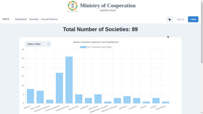
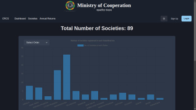
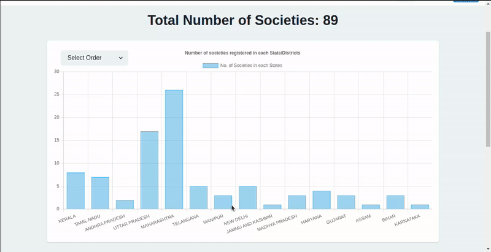
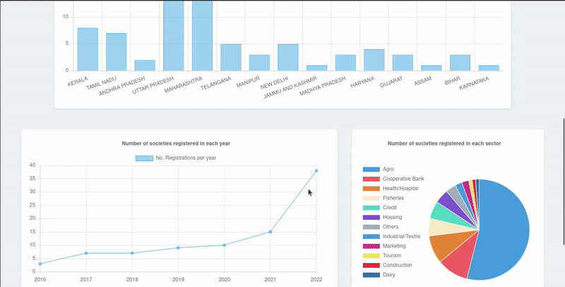
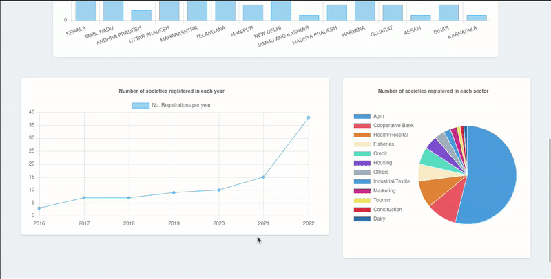

# CRCS-Portal Web Application

CRCS-Portal is a dynamic web application built to provide key statistics and insights about registered societies. It offers an interactive dashboard with various visualizations and two additional pages for detailed society listings and annual returns. This project is developed using React.js, React Chart.js 2 for visualizations, and the Chakra UI library for the user interface.

 

Check out the page using the link below.

## Table of Contents

- [Features](#features)
- [Dashboard](#dashboard)
- [Societies Page](#societies-page)
- [Annual Returns](#annual-returns)
- [Technologies Used](#technologies-used)
- [Getting Started](#getting-started)
- [Usage](#usage)
- [Contributing](#contributing)
- [License](#license)

## Features

- **Dashboard**: The dashboard provides a comprehensive view of society statistics through interactive visualizations.
- **Societies Page**: Lists all registered societies with insightful cards and filter options.
- **Annual Returns**: Shows the annual returns of each registered society with filtering capabilities.

## Dashboard

The dashboard is the heart of CRCS-Portal. It includes:

- Societies Distribution Among Each State (Interactive Bar Graph).
- Number of Societies in Each Sector (Interactive Pie Chart).
- Registration Over the Years (Interactive Line Graph).

These visualizations are interactive and allow users to explore data down to the district level, sector details, and specific years.

## Societies Page

The Societies Page displays all registered societies. It features:

- Insightful Cards: States with the most societies, and the sector with the highest number of registered societies.
- Filter Options: Filter the society table by state, sector, and year.
- Downloadable PDF: Users have the option to download a list of societies as a PDF document. This feature adds convenience for users who need to save or print this data for offline use or documentation.

### Bar Graph

### Line Graph

### Pie Chart

## Annual Returns

The Annual Returns page provides information on the annual returns of each registered society. It includes:

- Filtering: Societies can be filtered based on state, sector, and year.

- Downloadable PDF: Users have the option to download a list of society's annual returns as a PDF document. This feature adds convenience for users who need to save or print this data for offline use or documentation.

## Technologies Used

- React.js: Used as the core framework for building the web application.
- React Chart.js 2: Utilized for interactive data visualizations.
- Chakra UI: Used for building the user interface and ensuring a consistent design.
